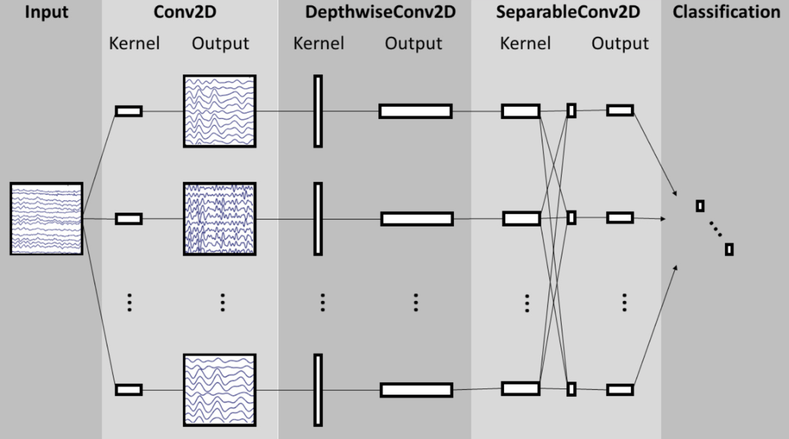

# Imagined speech decoding with EEGNet
With this repository, you can decode imagined speech using EEGNet.

# EEGNet
EEGNet is a CNN-based model made especially for EEG data. The EEGNet implemented in this repository is an unofficial implementation with PyTorch.
Official implementation of EEGNet with Tensorflow can be found here: https://github.com/vlawhern/arl-eegmodels
The original paper: https://iopscience.iop.org/article/10.1088/1741-2552/aace8c


# Dataset

An open-access dataset of EEG data during an inner speech task. The dataset consists of data from 10 subjects.

You can download the data here: https://openneuro.org/datasets/ds003626/versions/2.1.0
The original paper: https://www.biorxiv.org/content/10.1101/2021.04.19.440473v1


# How to use this repo

1. Run ```git clone https://github.com/naomike/EEGNet_inner_speech.git```
2. Place dataset under ```dataset``` directory
3. Build a docker container by running ```docker image build -t eegnet_env:latest .```
4. Run ```docker run --gpus all --rm -it -v ${PWD}:/home/EEGNet --name EEGNet_inner_speech eegnet_env:latest python experiment.py```, and you see resulting files created in the directory.
